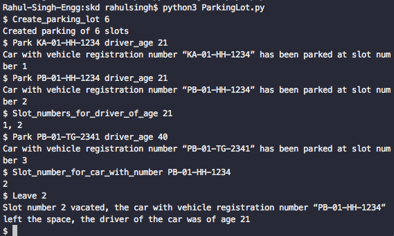

## Parking Allotment

## Dependencies

- Python 3 that's it.

## Description

We own a parking lot that can hold up to ‘n’ cars at any given point in time. Each slot is given a number starting at one increasing with increasing distance from the entry point in steps of one. We want to create an automated ticketing system that allows our customers to use our parking lot without human intervention.

When a car enters the parking lot, we want to have a ticket issued to the driver. The ticket issuing process includes:- 

We are taking note of the number written on the vehicle registration plate and the age of the driver of the car.

And we are allocating an available parking slot to the car before actually handing over a ticket to the driver (we assume that our customers are kind enough to always park in the slots allocated to them).

The customer should be allocated a parking slot that is nearest to the entry. At the exit, the customer returns the ticket, marking the slot they were using as being available.

Due to government regulation, the system should provide us with the ability to find out:-
1. Vehicle Registration numbers for all cars which are parked by the driver of a certain age,
2. Slot number in which a car with a given vehicle registration plate is parked. 
3. Slot numbers of all slots where cars of drivers of a particular age are parked.

We interact with the system via a file-based input system, i.e. it should accept a filename as an input. The file referenced by filename will contain a set of commands separated by a newline, we need to execute the commands in order and produce output.

## Setup Instructions

1. Clone the repository

2. Run `python3 ParkingLot.py` and enter inputs as shown.

  
  
3. Run `python3 ParkingLot.py -f sample_input.txt` in case of input as file.
  
  

